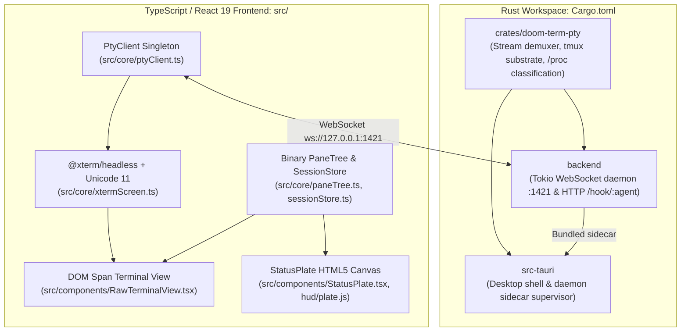

# Doom Term: Autonomous Agent Operating Protocol & Directives

Welcome to **Doom Term**. This document is the primary, authoritative operating directive for AI coding agents (Claude Code, Gemini/Antigravity, OpenAI Codex, OpenCode, Cursor, and sub-agent workers) operating within or developing this repository.

---

## ⚡ Executive Philosophy: The Four Axioms

1. **The Terminal Remains Pass-Through**: Plain `Ctrl` keys belong unconditionally to the foreground child process (`Ctrl+C` sends SIGINT, `Ctrl+Z` sends SIGTSTP, `Ctrl+D` sends EOF, etc.). All application management actions use `Ctrl+Shift`, `Ctrl+K`, or `Ctrl+1..9`.
2. **The Status Plate is the Only Persistent Chrome**: There are no persistent sidebars, tab strips, or floating toolbars. Every picker, prompt, action gate, or modal is transient.
3. **Never Invent Telemetry**: If a metric, rate limit, or context fill is unknown or unmeasured, it MUST render as `--` (unknown), never coerced to `0`, `0%`, or `idle`.
4. **"Four Materials, and No Fifth"**: Every visual surface must strictly resolve to **Plate** (striated neutral steel grey), **Recess** (`#14120f`), **1px Bevel pair** (`--bevel-up`, `--bevel-dn`), or **Ink** (contrast-guarded bone/tan/black).

---

## 🛡️ Non-Negotiable Design Invariants

These invariants are enforced by automated test suites in CI (`npm run test`):

* **Zero Border Radius**:
  `* { border-radius: 0; }` is enforced globally in [`src/styles/material.css`](src/styles/material.css). Tailwind utility classes like `rounded-*` are strictly forbidden.
* **Hard 1px Bevels (Zero Soft Shadows)**:
  Depth is created exclusively by the 1px bevel pair:
  - Raised Plate: `--bevel-up: inset 1px 1px 0 #a2a29f, inset -1px -1px 0 #2f2f2e;`
  - Recessed Well: `--bevel-dn: inset 1px 1px 0 #171716, inset -1px -1px 0 #8e8e8b;`
  Blurred `box-shadow`, CSS blur filters, and drop shadows are strictly forbidden.
* **5 Canonical State Colors (WCAG 2.1 AA Guaranteed)**:
  - `--st-live: #e0a92c` (Running, active cursor, streaming pulse)
  - `--st-pass: #5c9c3a` (Exit code 0, tests passing, patch applied)
  - `--st-fail: #ef4136` (Non-zero exit code, error, failure)
  - `--st-wait: #5b8ae8` (Waiting on user intervention, informational)
  - `--st-idle: #847c6e` (Inactive, settled, prompt ready)
  All text painted on `--ground` (`#14120f`) must achieve WCAG AA contrast ($\ge 4.5:1$), validated by [`src/styles/material.test.js`](src/styles/material.test.js).
* **Integer Cell Metrics & Canvas Scaling**:
  - Cell dimensions in [`src/core/cellMetrics.ts`](src/core/cellMetrics.ts) are strictly quantized to whole pixels (`Math.max(1, Math.floor(raw))`). Terminal grid columns and rows are floored.
  - **The rendered text must be pulled onto that same integer grid.** Quantizing the cell does not quantize the browser, which advances glyphs by the font's real fractional advance: the `font-mono` stack at 13px measures 7.80127px against a 7px cell, so text and the caret drift apart by a full cell every nine columns and a full row overflows its pane by a tenth of its width. `tracking()` returns the compensating letter-spacing, `useTerminalSize` publishes it as `--terminal-tracking`, and the terminal grid in [`RawTerminalView`](src/components/RawTerminalView.tsx) applies it. A new surface that renders terminal cells must do the same or it will drift.
  - The Status Bar canvas in [`src/hud/plate.js`](src/hud/plate.js) scales strictly at integer ratios (`2` or `3`). Fractional scaling is prohibited to prevent subpixel interpolation blur.
* **No Runtime Icon Libraries**:
  Do not import icon packages (`lucide-react`, `@heroicons`, `react-icons`). Use pure Unicode/ASCII glyphs (`▸`, `▪`, `×`, `⚖`, `❖`, `⑂`, `^`, `v`).

---

## 🏛️ System Architecture Topology

Doom Term operates under a **"One Implementation, Two Shells"** model:



### Core Subsystems & Responsibilities

1. **`crates/doom-term-pty/`**:
   - [`demuxer.rs`](crates/doom-term-pty/src/demuxer.rs): Slices PTY bytes, splices split UTF-8 multi-byte sequences, intercepts OSC 133 semantic marks and OSC 1337 agent states, and immediately answers terminal status queries (`CSI 6n`, `OSC 10/11`).
   - [`session.rs`](crates/doom-term-pty/src/session.rs) & [`tmux.rs`](crates/doom-term-pty/src/tmux.rs): Manages PTY pairs and private tmux sessions (`$TMPDIR/doom-term-tmux-$UID/socket`). Maintains a 500-event ring buffer per session; reconnecting rebinds the socket without spawning duplicate tmux clients or killing processes.
   - [`foreground.rs`](crates/doom-term-pty/src/foreground.rs): Inspects Linux `/proc/<pid>/stat` to discover true foreground process group (`tpgid`), binary comm, and active agent classification (`claude`, `codex`, `gemini`, `agy`, etc.). `open_files` reads `/proc/<pid>/fd` for the same reason: a descriptor proves which file belongs to which pane, where a directory scan can only guess.
2. **`backend/`**:
   - Standalone Tokio daemon listening on `127.0.0.1:1421`. Serves both WebSocket PTY clients and HTTP `POST /hook/:agent` events.
   - [`backend/src/usage/`](backend/src/usage/): Real-time token usage parser and context window calculator for Anthropic, OpenAI, and Gemini.
   - **Transcript attribution is by evidence, never by directory.** A pane's transcript is resolved from the agent hook's own `transcript_path` ([`hint.rs`](backend/src/usage/hint.rs)) first, and otherwise from the rollout the pane's foreground process actually holds open ([`codex.rs`](backend/src/usage/codex.rs) — Codex keeps its `.jsonl` open for the life of the session, so `/proc/<pid>/fd` settles ownership the way a scan cannot). Two candidates is ambiguity and ambiguity is `--`. Do not restore a `cwd` scan: it cannot tell two agents in one repository apart.
3. **`src-tauri/`**:
   - Native desktop application wrapper bundling `doom-term-server` as an external sidecar binary via `tools/build-sidecar.mjs`.
4. **`src/core/`**:
   - Decoupled headless screen registry ([`emulatorRegistry.ts`](src/core/emulatorRegistry.ts)). Coalesces screen updates via `requestAnimationFrame` before triggering React state.
   - Binary layout algebra ([`paneTree.ts`](src/core/paneTree.ts)): Handles horizontal/vertical binary splits, 1px divider drag resizing, equalization, spatial focus navigation, and zooming while keeping sibling DOM nodes mounted.
   - Authoritative keymap ([`keymap.ts`](src/core/keymap.ts)).
5. **`src/hud/`**:
   - Reference bitmap canvas renderer ([`plate.js`](src/hud/plate.js)): 480x32 pixel canvas with custom bitmap fonts (`FONT_BIG` 8x14, `FONT_SM` 5x6), 9 agent mark icons with 2 Hz cosine pulse glow, elastic attention queue (waiting rows), credentials badges, and token table.

---

## ⌨️ Authoritative Keyboard Contract

The single source of truth for all bindings is [`src/core/keymap.ts`](src/core/keymap.ts).

### Global Application Chords
| Key Binding | Action |
| :--- | :--- |
| `Ctrl+K` / `Ctrl+Shift+K` / `Ctrl+Shift+P` | Attention-first session switcher and command palette |
| `Ctrl+1` .. `Ctrl+9` | Direct stable session slot jump |
| `Ctrl+Shift+A` | Next session needing attention |
| `Ctrl+Shift+arrows` | Spatially focus adjacent pane |
| `Ctrl+Shift+Space` | Temporary direct pane label overlay (`A`, `B`, `C`...) |
| `Ctrl+Shift+Z` | Toggle focused pane zoom |
| `Ctrl+Shift+T` | Spawn new terminal session |
| `Ctrl+Shift+W` | Close idle shell or prompt PARK vs KILL for live process |
| `Ctrl+Shift+O` | Open workspace folder picker |
| `Ctrl+Shift+M` | Toggle sound FX mute |

### View-Local Terminal Chords
| Key Binding | Action |
| :--- | :--- |
| `Ctrl+Shift+C` | Native selection copy |
| `Ctrl+Shift+V` | Child-checked clipboard paste; unsupported multiline input is refused |
| `Ctrl+Shift+[` / `]` | Jump to previous / next agent turn mark |
| `Ctrl+Shift+Y` | Copy current agent turn |
| `Ctrl+Shift+E` | Developer quick select (URL, file:line, git SHA, issue) |
| `Ctrl+Shift+F` | Search session scrollback (`Ctrl+F` passes through) |
| `End` | Return scrollback to newest line |
| `Shift+Enter` / `Alt+Enter` | Newline without sending — encoded as `ESC CR`, never intercepted |

**Rule**: Never bind unadorned `Ctrl+[A-Z]` to an application action. Those belongs exclusively to the running process.

**Newline in an agent composer**: `Shift+Enter` is passed to the child as `ESC CR`
(`\x1b\r`), which is the sequence Claude Code's own `/terminal-setup` installs
into iTerm2, VS Code, Alacritty and Zed for this key. It is a pass-through
encoding in [`keyToBytes`](src/components/RawTerminalView.tsx), not an app
chord: nothing in the app consumes it, and plain `Enter` still submits.

**Clipboard transport**: `Paste { request_id, id, text }` is separate from ordinary
`Write`. `PasteResult { request_id, session_id, error }` is correlated on both ids.
Never queue, reconnect-replay, or automatically retry a paste. Unknown delivery
must be reported as unknown. The PTY adapter normalizes CR/CRLF, strips DEL and
C0 controls other than tab/LF, and caps original UTF-8 input at 1 MiB. Direct PTYs use observed
child mode 2004. Tmux uses its exact pane's `bracket_paste_flag` and a conditional
command queue with a private stdin-loaded buffer, bounded helpers, and cleanup.
The frontend emulator's outer tmux mode is not child authorization. See the
[paste contract](docs/superpowers/specs/2026-09-08-child-checked-paste-design.md).

---

## 🤖 Agent Hooks Infrastructure

Doom Term integrates natively with CLI coding agents (Claude Code, OpenAI Codex, etc.) via low-latency shell hooks:

- **Hook Script**: [`tools/agent-hooks/doom-term-hook.sh`](tools/agent-hooks/doom-term-hook.sh)
  - **Bounded Critical Path**: Stdin and HTTP share a 1.8-second deadline plus 0.2-second forced-kill grace; the wrapper unconditionally exits `0`. Input is capped at 64 KiB. GNU `timeout`/`gtimeout` is required; without it the hook skips posting rather than reading unbounded stdin. Curl defaults and inherited proxies are disabled.
  - Forwards agent event JSON over HTTP: `POST http://127.0.0.1:${PORT:-1421}/hook/${AGENT}`.
- **Hook Installer**: [`tools/agent-hooks/install.mjs`](tools/agent-hooks/install.mjs)
  - Additive patching of `~/.claude/settings.json` and `~/.codex/hooks.json`.
  - Tags entries with `# doom-term-hook` so they can be idempotently installed or uninstalled without disturbing existing user hooks.
  - Events tracked: `PermissionRequest` (sets `blockedOnUser = true`, turning Status Bar indicator to `WAIT` and activating native notification) and `Stop` (clears wait state).

---

## 🚀 Development & Verification Workflows

To ensure zero regressions across TypeScript, DOM, canvas, and Rust crates, use the following commands:

```bash
# 1. Typecheck the TypeScript codebase
npm run typecheck

# 2. Run pure Node tests (HUD/Material/tools) and Vitest component suites
npm test

# 3. Production build. A typecheck is not a build: this catches what only the
#    bundler sees.
npm run build

# 4. Pixel-exact HUD check. Renders the plate from src/hud/plate.js and diffs it
#    against the committed reference PNGs. FAILS CLOSED — it previously passed
#    `--if-exists` and exited zero when the image was absent, so the unified
#    command reported success without comparing a single pixel.
npm run hud:check

# 5. Check Rust crates in workspace (doom-term-pty, backend)
cargo check

# 6. Run Rust unit and integration tests
cargo test

# 7. Compile the desktop shell. src-tauri is deliberately NOT a default
#    workspace member — it needs glib/gtk/dbus-1/webkit2gtk — so the generic
#    cargo commands above never touch it. This asks explicitly, and reports a
#    missing-system-package outcome as an ENVIRONMENT BLOCK, distinct from
#    both a pass and a compile failure.
npm run check:tauri

# 8. Single unified verification command for agents: all of the above.
npm run agent:verify
```

**Not in the unified command**, because nothing headless can produce its input:

```bash
# Diffs a real browser screenshot of the canvas against the reference. Capture
# .artifacts/plate-actual.png from the running app first; without it this
# prints ENVIRONMENT BLOCK rather than passing silently.
npm run hud:check:browser
```

---

## 📚 Documentation Directory Taxonomy

When exploring or updating documentation, follow this taxonomy:

- [`README.md`](README.md): Primary user-facing documentation, quickstart, Reformation capabilities, and design overview.
- [`AGENTS.md`](AGENTS.md): This file. Single authoritative source of truth for AI agents.
- [`docs/README.md`](docs/README.md): Comprehensive documentation directory portal and taxonomy map.
- [`docs/REFORMATION_AGENT_REVIEW.md`](docs/REFORMATION_AGENT_REVIEW.md): Implementation map, entry points, and test specifications for the 10 Reformation capabilities.
- [`docs/design/`](docs/design/): Visual design system specimens, HTML proofs, and reference PNG baselines.
- [`docs/superpowers/specs/`](docs/superpowers/specs/) & [`docs/superpowers/plans/`](docs/superpowers/plans/): Chronological architecture specs and milestone execution plans.
- [`DOOM_TERM_BLUEPRINT.md`](DOOM_TERM_BLUEPRINT.md): Archived pre-Reformation concept blueprint (retained for historical context).
