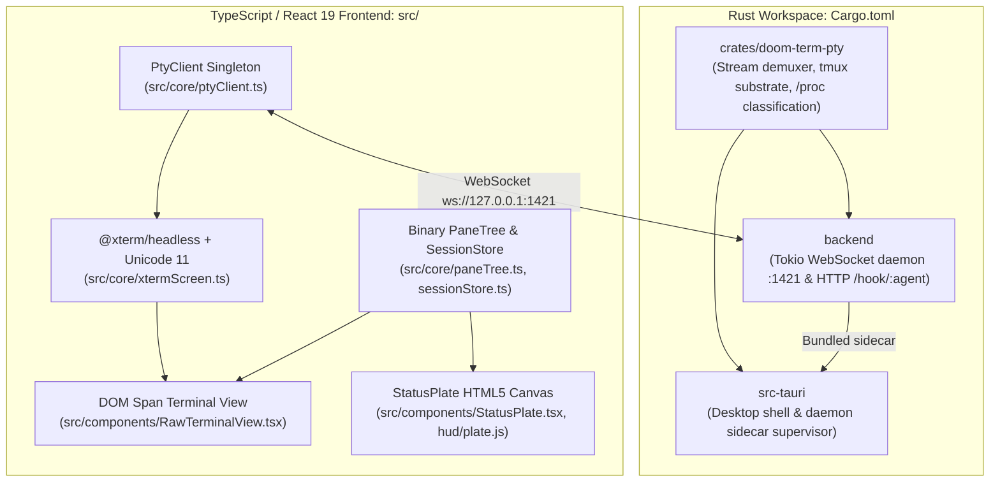

<div align="center">

```
______ _____ _____ ___  ___   _____ _____ _____ ___  ___
|  _  \  _  |  _  ||  \/  |  |_   _|  ___| ___ \|  \/  |
| | | | | | | | | || .  . |    | | | |__ | |_/ /| .  . |
| | | | | | | | | || |\/| |    | | |  __||    / | |\/| |
| |/ /\ \_/ /\ \_/ /| |  | |    | | | |___| |\ \ | |  | |
|___/  \___/  \___/ \_|  |_/    \_/ \____/\_| \_|\_|  |_/
```

### **A Doom (1993)-Inspired Agentic Coding Terminal Manager**
*A chromeless, pass-through terminal for supervising parallel developer and agent sessions.*

[](https://github.com/CMLeadmon/Doom-Term/actions/workflows/ci.yml)
[](https://opensource.org/licenses/MIT)
[](https://react.dev/)
[](https://www.rust-lang.org/)
[](https://tauri.app/)
[](https://vitejs.dev/)

---

[Reformation Capabilities](#️-10-reformation-architectural-capabilities) • [STBAR Telemetry](#-classic-status-bar-stbar-as-developer-telemetry) • [Quickstart](#-quickstart) • [Keybindings](#-keyboard-shortcuts) • [Architecture](#-system-architecture) • [Agent Guide](AGENTS.md)

</div>

---

## ⚡ Vision & Philosophy

**Doom Term** merges high-performance terminal emulation and autonomous AI coding agents with the tactile, industrial aesthetic of **Doom (1993)**.

Rather than a generic developer tool with a dark theme or bloated block cards, Doom Term is an immersive, lean developer command center:
* **The Classic Doom Status Bar (STBAR)** shows observed session metadata, supported providers' context and rate-limit readings, environment markers, activity, and system toggles. Unknown readings stay `--`; container detection is not proof of a security sandbox.
* **Pass-Through Terminal First**: Unadorned Ctrl-letter keys belong unconditionally to the child process. The terminal line discipline handles interrupt, suspend, and EOF in cooked mode; raw-mode applications receive the control bytes without an extra forced signal. Supervisor actions live strictly in `Ctrl+Shift`, `Ctrl+K`, or `Ctrl+1..9`.
* **Durable Process Persistence**: A private tmux server keeps processes alive across daemon restarts. History recovery is bounded; exact replay fidelity remains under audit. See the [beta readiness ledger](docs/BETA_READINESS.md) before relying on it for primary work.
* **Strict 1993 Material System**: "Four materials, and no fifth" — Plate (striated neutral steel grey), Recess (`#14120f`), 1px Bevel pair (`--bevel-up`, `--bevel-dn`), and Ink (WCAG 2.1 AA bone/tan/black). Zero border radius everywhere.
* **Agent Permission Signals**: The additive installer supports Claude Code and Codex hooks. Agents retain their own approval policy; Doom Term can show a review banner but does not approve actions automatically. Stdin and HTTP share a two-second timeout budget; oversized events are dropped. Hooks require `curl`, `head`, and GNU coreutils `timeout` (or `gtimeout` on macOS); without a deadline utility they return immediately without posting.
* **Attributed Context Readings**: Claude context and Codex context/rate readings require a hook with the exact pane id and a matching Linux foreground process identity. No directory-only guessing: missing, expired, or unverifiable attribution renders `--`. Account-level Claude quota is a separate reading from the daemon's configured account.

---

## 🎮 Classic Status Bar (STBAR) as Developer Telemetry

The bottom 32 pixels (scaled at integer ratios of 2x or 3x) host the classic Doom Status Bar, transformed into an authoritative developer HUD:

```
+-----------------------------------------------------------------------------------------------------------------------------+
| CONTEXT   USAGE   | [AGENT] SHELL/AGENT  PATH           BRANCH     | WAITING / SCROLL-FIND         | ENV      CHIPS  METRICS          |
|    --       --   | [ (o) ] CLAUDE CODE  ~/PROJECTS...  FEATURE... | 4 | 2 ? PTY-FIX  CLAU | 7 . DOCS |  CTNR    [B Y R] BUF 14   --       |
| (x0..44) (x45..90)| (x104....................................x330) | (x334.......Elastic......W-146)| (W-99)   (W-81)  OUT  3   32       |
+-----------------------------------------------------------------------------------------------------------------------------+
```

| HUD Element | Doom 1993 Reference | Doom Term Developer Mapping | Observed Truth Rule |
| :--- | :--- | :--- | :--- |
| **CONTEXT** | Bullet Count (x44, y171) | **Context Window Fill %** | Consumed percentage of LLM context window (e.g. `61%`). Renders `--` if unmeasured. |
| **USAGE** | Health % (x90, y171) | **Provider Rate Limit %** | Percentage of provider API usage limit consumed (e.g. `34%`). Renders `--` if unmeasured. |
| **AGENT MARK** | Doomguy Mugshot (x143, y168) | **Agent Identity Well** | 24x29 recessed well rendering active agent glyph (`claude`, `antigravity`, `aider`, `gemini`, `codex`, `copilot`, `grok`, `opencode`, or `shell`). Pulses at 2 Hz with a raised-cosine metal glow and shock ring when busy; still when halted. |
| **PANEL** | Armor / Weapon Slots | **Session Metadata** | Active agent or shell name, current working directory, and Git branch. |
| **ELASTIC CENTER** | (None in Doom 1993) | **Waiting Queue / Transport** | Actionable background sessions across workspaces, or scrollback search during `Ctrl+Shift+F`. Up to two columns of three rows; the numeral counts sessions needing attention, not running ones filling spare rows. |
| **ENV / REVIEW** | Armor % (x221, y171) | **Observed Environment** | `CTNR` means container markers detected, `TREE` a Git worktree, `HOST` no detected container/worktree, and `--` unmeasured. None guarantees child-process confinement. `ASK` enables review banners; `WAIT` means a reported permission request. |
| **CHIPS** | Keycard slots | **System Toggles** | Blue: sound FX; gold: desktop notification preference and browser permission; red: failed sessions or disconnected daemon. These are not credential checks. |
| **METRICS** | Ammo Tables | **Observed Counts** | `BUF`: rendered lines, `CMD`: observed command completions, `SES`: open sessions, `BAD`: sessions with a failed last result. Unmeasured command counts and limits are `--`. Token-table rendering exists, but per-token totals are not currently wired into the app. |

---

## 🏛️ 10 Reformation Architectural Capabilities

The **Reformation** release refines Doom Term into a robust, chromeless terminal supervisor for developers who know their tools:

1. **Actionable Attention Queue & Acknowledgement Policy**: Status plate waiting rows display sessions blocked on user input or errors. Clicking a row or pressing `Ctrl+Shift+A` jumps immediately to the waiting session. Acknowledged sessions stay quiet until they produce new output. Each row carries a status glyph in one of the canonical state colours — `?` asks you (`--st-wait`), `×` failed (`--st-fail`), `·` quiet (`--st-idle`), `▪` working (`--st-live`, pulsing) — shape as well as colour, so the reading survives a colourblind operator. A status the plate does not recognise draws the unknown bar rather than falling through to `quiet`.
2. **Session Notifications**: Background asks, failures, and long-running commands (>10s) can trigger desktop alerts. Browser notification clicks select the session. The native Linux notification path displays alerts but does not yet route clicks back to sessions.
3. **Attention-First MRU `Ctrl+K` Session Switcher**: Fuzzy search across sessions, directories, git branches, and transcript outputs with a live scrollback tail preview pane.
4. **Terminal Clipboard Contract**: `Ctrl+Shift+C` copies standard selections. `Ctrl+Shift+V` sends a dedicated, child-checked paste request: CR/CRLF becomes LF, embedded control bytes are removed (tabs and newlines remain), and inputs above 1 MiB are rejected. Multiline paste is refused unless the actual child enables bracketed paste; tmux's outer mode cannot authorize it. Clipboard failures and refusals appear in a transient notice. Paste is never queued across reconnects or retried automatically; a timeout means delivery is unknown. Update both frontend and daemon together. Nested multiplexers and unobserved process replacement are not universally covered. Modifier triple-click selects a trusted command/turn region.
5. **Navigable Agent Turn Marks**: A conservative prompt-pattern heuristic marks where each agent turn begins — an anchored match on the recognized agent's own inline prompt, not OSC 133. Only agents with a confirmed prompt shape are marked; anything else gets no marks, because a boundary you navigate to and find nothing at is worse than none. Marks established for a session survive that agent exiting. Jump between turns with `Ctrl+Shift+[` and `]`, or copy the active turn with `Ctrl+Shift+Y`.
6. **Developer Quick Select (`Ctrl+Shift+E`)**: A transient overlay scans the newest 200 rendered lines, extracting URLs, file:line paths, Git commit SHAs, and issue identifiers for single-key copying (`Enter`) or terminal insertion (`Shift+Enter`).
7. **Minimum Persistent Binary Split Tree**: The window layout is modeled as a persistent binary `PaneTree`. Panes resize with 1px draggable dividers, collapse safely on close, and equalize on demand (`Ctrl+K`).
8. **Spatial Focus Navigation & Direct Labels**: Navigate panes spatially with `Ctrl+Shift+arrows`, display temporary direct jump labels with `Ctrl+Shift+Space`, and toggle focused pane zoom with `Ctrl+Shift+Z` while keeping sibling pane DOM mounted.
9. **Safe Process Termination (PARK vs KILL)**: Closing an idle shell (`Ctrl+Shift+W`) kills it immediately. Closing a running command or agent presents an explicit prompt with **PARK** as the safe default (geometry dismissed, process continues running in daemon) versus **KILL**.
10. **Durable tmux Session Discovery & Explicit Recovery**: The daemon discovers orphaned in-memory or private tmux sessions. The switcher exposes an explicit `RECOVERY` entry allowing developers to reconnect without rerunning commands.

Full verification proofs and component maps are detailed in [`docs/REFORMATION_AGENT_REVIEW.md`](docs/REFORMATION_AGENT_REVIEW.md).

---

## 🖥️ Platform Support

Doom Term identifies the agent running in a pane from the operating system, never
from a tab title. There are exactly two witnesses for that, and which ones exist
decides what the app can honestly report.

| | Linux | macOS | Windows |
| :--- | :--- | :--- | :--- |
| Terminal, splits, scrollback, status plate | ✅ | ✅ | ✅ |
| Agent identification (mugshot, agent well) | ✅ `/proc/<pid>/stat` `tpgid` | ✅ via tmux `pane_current_command` | ❌ **neither witness exists** |
| Keyboard pass-through by foreground process | ✅ | ✅ (tmux) | ❌ |
| Durable sessions across a daemon restart | ✅ tmux | ✅ tmux | ❌ no native tmux |
| Child-checked paste | ✅ | ✅ | ❌ `unsupported on this platform` |
| Claude context reading | ✅ hook `transcript_path` | ✅ | ⚠️ hook needs `bash`, `curl`, GNU `timeout` |
| Codex context / rate reading | ✅ `/proc/<pid>/fd` | ❌ `--` | ❌ `--` |
| Built and tested in CI | ✅ | ⚠️ compile-checked | ⚠️ compile-checked |

**Linux is the reference platform.** It is the only one the full `npm run agent:verify`
gate runs on.

**macOS is supported** through the portable fallback: with tmux installed (Homebrew
prefixes are searched directly, since a Finder-launched app cannot see them through
`PATH` alone), tmux's own `pane_current_command` and `pane_current_path` stand in for
`/proc`. Codex context stays `--`, because attributing a rollout file to a pane
requires reading that process's open descriptors.

**Windows is a degraded build, and is published as such.** A shell runs under ConPTY
and the terminal itself works, but Windows has neither `/proc` nor a native tmux — so
there is no witness at all for which process is in the foreground. The agent well
never lights up, sessions do not survive a daemon restart, and paste cannot be
child-checked. This is not a bug with a fix pending; it needs a third foreground
witness written against the Win32 console API. Per Axiom 3 the affected readings
render `--` rather than inventing a value.

---

## 🚀 Quickstart

### Prerequisites
* **Node.js**: `22.18+` (tests execute TypeScript directly)
* **Rust**: current stable (for backend PTY daemon & Tauri shell)
* **Git**: `2.30+`
* **tmux**: `3.7+` for child-checked paste and sessions that survive a daemon restart (optional; the
  app reports when it falls back to a non-durable direct PTY)

### 1. Clone & Install Dependencies
```bash
git clone https://github.com/CMLeadmon/Doom-Term.git
cd Doom-Term
npm install
```

### 2. Run the Desktop App

Doom Term is a desktop application first. The PTY daemon ships inside the app
bundle as a sidecar, so this is the only command you need — it builds the
daemon, starts it, and shuts it down with the window:

```bash
npm run tauri dev
```

### 2b. Or run it in a browser

The same UI runs against a daemon you start yourself:

```bash
# Terminal 1: the PTY WebSocket daemon (port 1421)
npm run server

# Terminal 2: the Vite dev server (port 1420)
npm run dev
```

Open **[http://localhost:1420](http://localhost:1420)**.

> The daemon accepts loopback binds only and checks browser origins and WebSocket
> Host headers. Set `DOOM_AUTH_TOKEN` to require an access token; the UI asks for
> it before opening terminals and keeps it only in window memory. Native local
> clients are otherwise trusted, so configure a token on shared machines.
> Remote access is unsupported. See the ongoing [beta audit](docs/BETA_READINESS.md)
> for verified capabilities and known limitations.

### 2c. The first launch asks where to open

With nothing to restore, Doom Term opens the workspace picker before it starts
anything: the first terminal belongs in a folder you chose, not in whatever
directory the app happened to launch from. Nothing is spawned and nothing is
remembered until you answer, so quitting at the picker leaves the next launch
just as fresh. `Esc` opens your home directory.

Later launches restore the workspaces you left open and do not ask again.
`Ctrl+Shift+O` opens the same picker at any time, and adds a workspace beside
the current one rather than replacing it.

### 3. Run Test Suites
```bash
# Runs both Node native test runner and Vitest component suite
npm test
```

---

## ⌨️ Keyboard Shortcuts

| Shortcut | Action |
| :--- | :--- |
| <kbd>Ctrl</kbd> + <kbd>K</kbd> | Open session switcher and command palette |
| <kbd>Ctrl</kbd> + <kbd>Shift</kbd> + <kbd>P</kbd> | Alternate palette binding |
| <kbd>Ctrl</kbd> + <kbd>Shift</kbd> + <kbd>T</kbd> | Spawn New Terminal Session |
| <kbd>Ctrl</kbd> + <kbd>Shift</kbd> + <kbd>W</kbd> | Close idle shell or choose PARK/KILL for live work |
| <kbd>Ctrl</kbd> + <kbd>1</kbd> .. <kbd>9</kbd> | Select stable session number |
| <kbd>Ctrl</kbd> + <kbd>Shift</kbd> + <kbd>A</kbd> | Next session needing attention |
| <kbd>Ctrl</kbd> + <kbd>Shift</kbd> + arrow | Focus spatially adjacent pane |
| <kbd>Ctrl</kbd> + <kbd>Shift</kbd> + <kbd>Space</kbd> | Show direct pane labels |
| <kbd>Ctrl</kbd> + <kbd>Shift</kbd> + <kbd>Z</kbd> | Toggle focused pane zoom |
| <kbd>Ctrl</kbd> + <kbd>Shift</kbd> + <kbd>C</kbd> / <kbd>V</kbd> | Copy selection / safe paste |
| <kbd>Ctrl</kbd> + <kbd>Shift</kbd> + <kbd>[</kbd> / <kbd>]</kbd> | Previous / next agent turn |
| <kbd>Ctrl</kbd> + <kbd>Shift</kbd> + <kbd>Y</kbd> | Copy current agent turn |
| <kbd>Ctrl</kbd> + <kbd>Shift</kbd> + <kbd>E</kbd> | Quick-select developer reference |
| <kbd>Ctrl</kbd> + <kbd>Shift</kbd> + <kbd>M</kbd> | Toggle sound FX |
| <kbd>Ctrl</kbd> + <kbd>C</kbd> | Send `SIGINT` to Foreground Process |
| <kbd>Ctrl</kbd> + <kbd>Z</kbd> | Send `SIGTSTP` to Foreground Process |
| <kbd>Ctrl</kbd> + <kbd>F</kbd> | Search active session scrollback |
| <kbd>End</kbd> | Return active session to newest line |
| <kbd>Escape</kbd> | Close Modal / Deny Security Approval |

---

## 📐 System Architecture

Doom Term operates under a **"One Implementation, Two Shells"** model:



---

## 🎨 Design System & Material Rules

Doom Term's visual design is strictly governed by the following core constraints:

* **Zero Border Radius**: `* { border-radius: 0 }` is enforced globally.
* **Hard 1px Bevels**: Depth is created solely through the 1px bevel pair (`--bevel-up` and `--bevel-dn`). No blurred box shadows.
* **5 Canonical State Colors (WCAG 2.1 AA Guaranteed)**:
  * Live: `--st-live: #e0a92c`
  * Passed: `--st-pass: #5c9c3a`
  * Failed: `--st-fail: #ef4136`
  * Waiting: `--st-wait: #5b8ae8`
  * Idle: `--st-idle: #847c6e`
* **Integer Plate Scaling**: Status plate is always scaled by `Math.floor(available / 480)`, preserving pixel-exact striations and text contrast.

---

## 📄 License

This project is licensed under the [MIT License](LICENSE).
Freedoom assets are distributed under the BSD 3-Clause License.
Doom is a registered trademark of id Software / ZeniMax Media.
